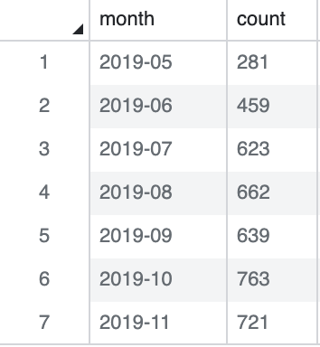

# data-engineering

## 월 별로 active 한 사용자 수 count

### 1. INNER JOIN raw_data.user_session_channel & raw_data.session_imestamp ON sessionid
~~~
CREATE TABLE adhoc.chris_test AS
SELECT usc.*, st.ts
FROM raw_data.session_timestamp st
JOIN raw_data.user_session_channel usc on st.sessionid = usc.sessionid;
~~~

### 2. 월 별 세션 count
#### 2-1. 일 별 count
~~~
SELECT date(ts), count(userid)
FROM adhoc.chris_test
GROUP BY date(ts)
ORDER BY date(ts);
~~~

#### 2-2. 월 별 count
~~~
SELECT extract(month from ts) as M, count(distinct((userid))
FROM adhoc.chris_test
GROUP BY M
ORDER BY M;
~~~

#### 2-3. format 정리, duplicate 삭제
~~~~
SELECT convert(char(7),date_trunc('month', ts)) as Month, count(distinct((userid)))
FROM adhoc.chris_test
GROUP BY date_trunc('month', ts)
ORDER BY date_trunc('month', ts);
~~~~

